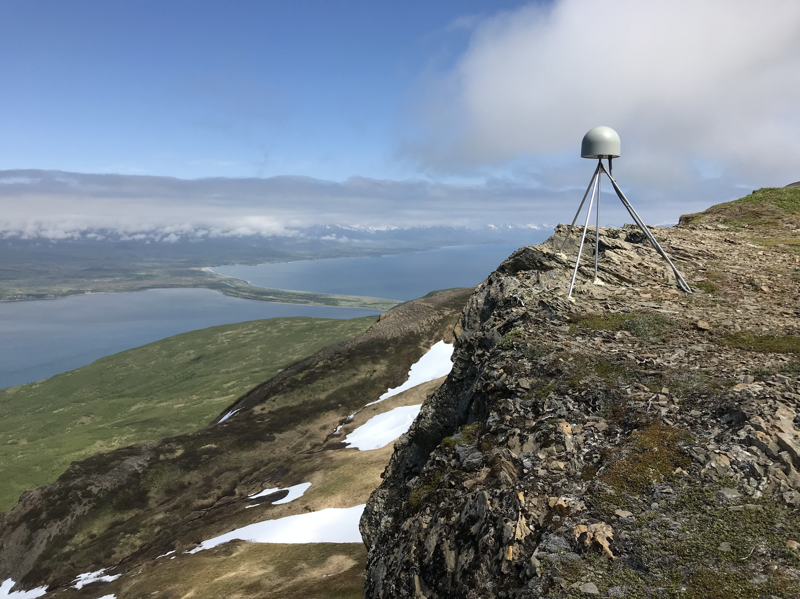
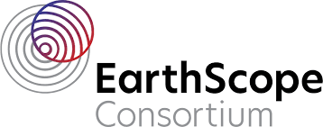

GNSS Velocity Data Center
###########

A Prototype GNSS Velocity Data Center and Applications to Seismic Network Operations

.. toctree::
   :hidden:
   :maxdepth: 2
   :caption: Introduction:

   pages/introduction.md
   pages/method.md

.. toctree::
   :hidden:
   :maxdepth: 2
   :caption: Applications:

   pages/applications/def.md
   pages/applications/atmo.md
   pages/applications/network.md
   
.. toctree::
   :hidden:
   :maxdepth: 2
   :caption: Interfaces: 

   pages/software.md
   pages/community.md

.. note::
   This project is funded by NASA ROSES: NASA 22-ESI22-0004

|pic1|      |pic2|  |pic3|

.. |pic3| image:: https://upload.wikimedia.org/wikipedia/commons/thumb/e/e5/NASA_logo.svg/800px-NASA_logo.svg.png
   :width: 15%
   :target: https://nasa.gov